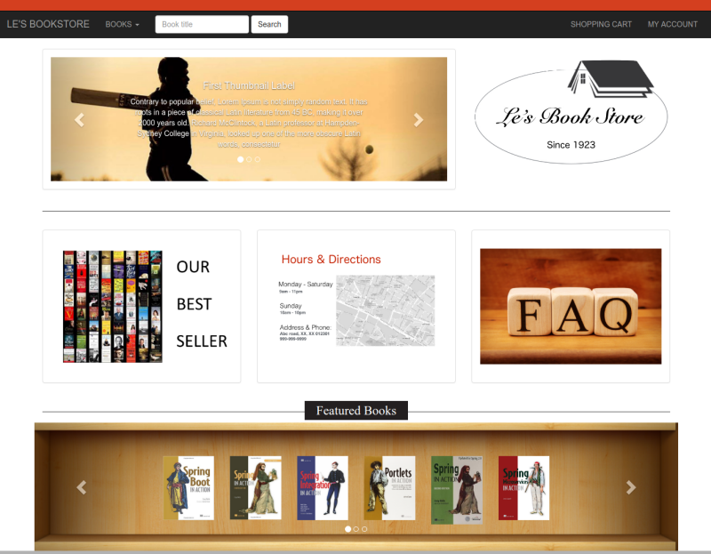
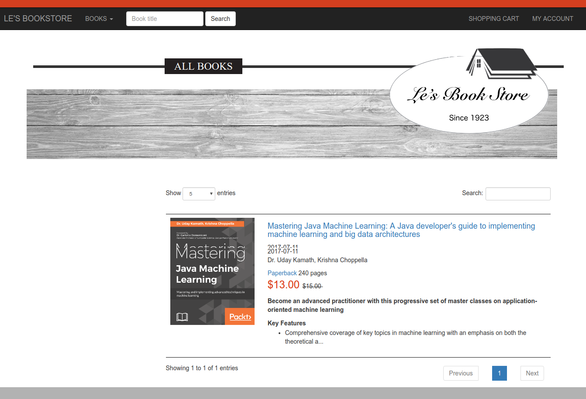
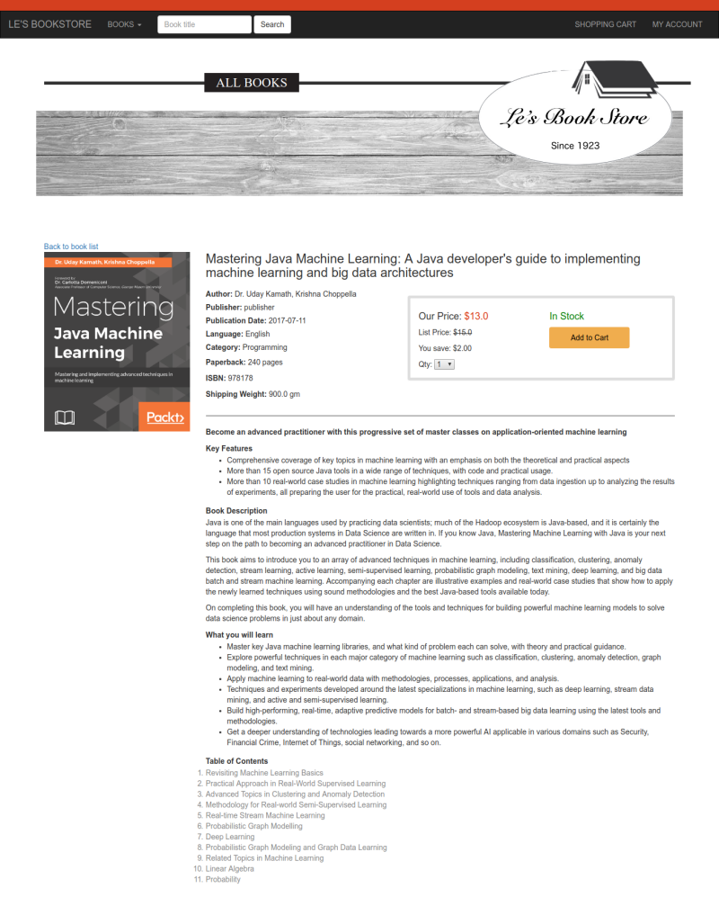
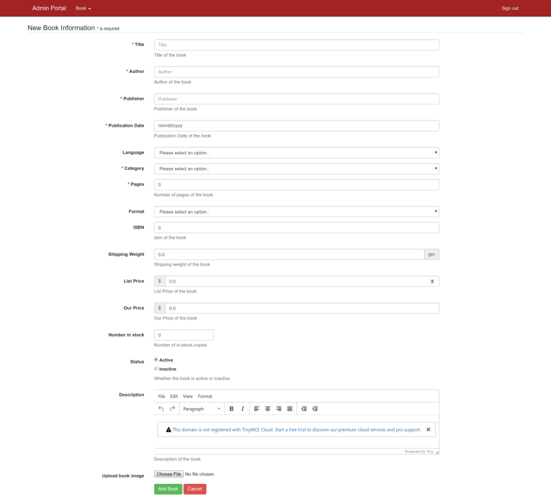
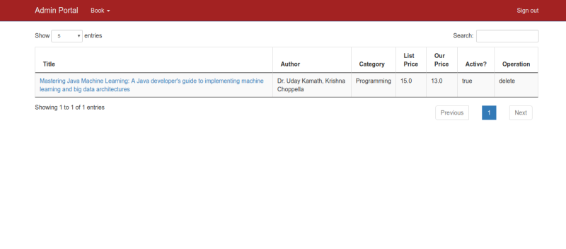
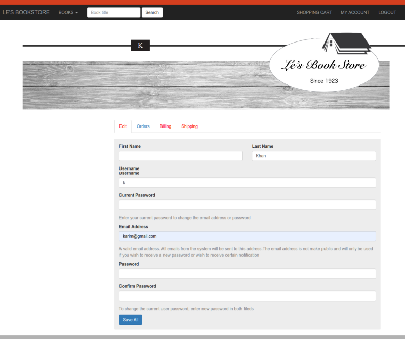

# Le's Bookstore

This is an e-commerce web application built by me while covering the [udemy]([https://www.udemy.com/complete-e-commerce-course-javaspringhibernate-and-mysql/](https://www.udemy.com/complete-e-commerce-course-javaspringhibernate-and-mysql/)) course using Java,Spring,Hibernate and MySQL. The project was built focusing the MVC pattern. It is divided into two individual modules one is [adminportal]([https://github.com/mefalamin/Le-s-Bookstore-adminportal](https://github.com/mefalamin/Le-s-Bookstore-adminportal)) and another is [user-section]([https://github.com/mefalamin/Le-s-Bookstore-user-section](https://github.com/mefalamin/Le-s-Bookstore-user-section)) running both independently. Some features are still under development. Hope you can have an idea of building a site using Java, Spring and hibernate by this project.

## Built With

* [Java 1.8
](https://www.oracle.com/technetwork/java/javaee/downloads/jdk8-downloads-2133151.html)
* [Spring Boot](https://spring.io/projects/spring-boot) - framework
* [Maven](https://maven.apache.org/) - Dependency Management
* [Thymeleaf](https://www.thymeleaf.org/) - Templating engine

## Some Screenshots

|  |
|:--:|
| *Front Page* |

|  |
|:--:|
| *Bookshelf* |

|  |
|:--:|
| *Details of a Book* |

|  |
|:--:|
| *Admin Adding Book in list* |

|  |
|:--:|
| *Admin Managing Book Panel * |

|  |
|:--:|
| *User Profile Panel * |

|  |
|:--:|
| *User Payment Section * |

## License

This project is licensed under the MIT License - see the [LICENSE.md](LICENSE.md) file for details
